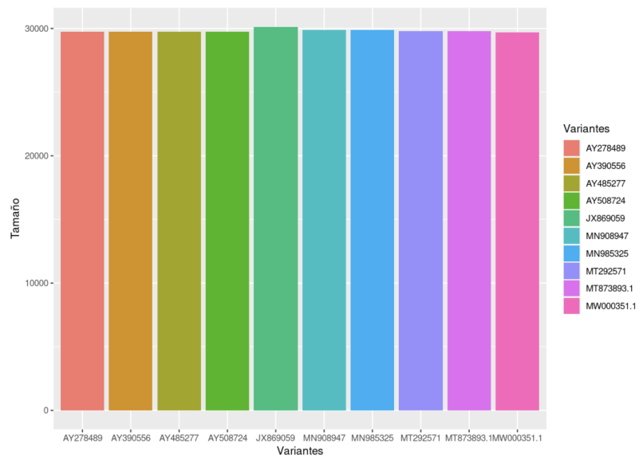
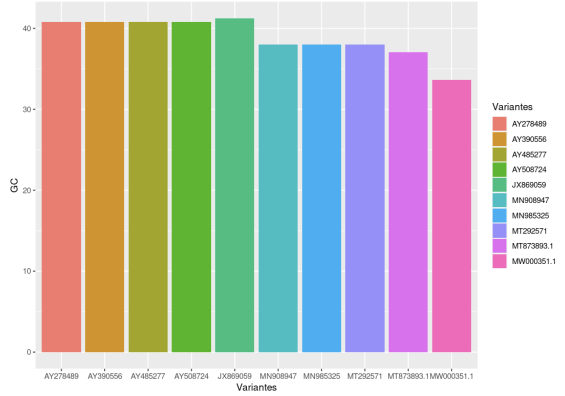
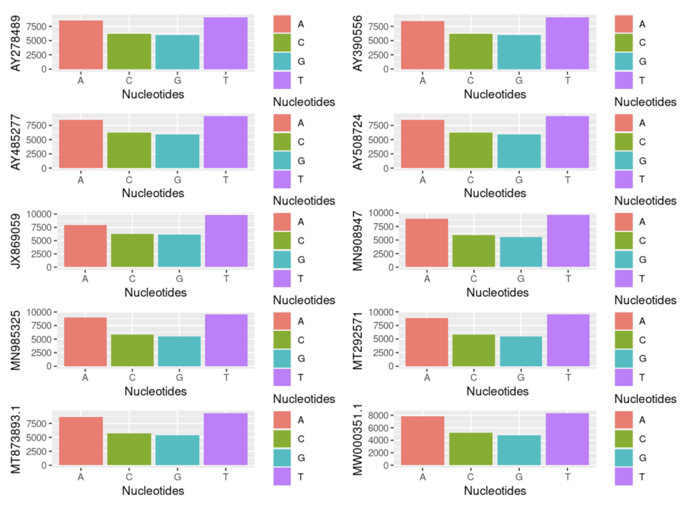
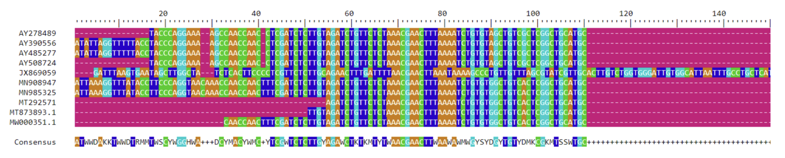
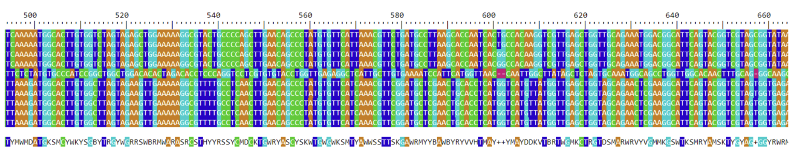
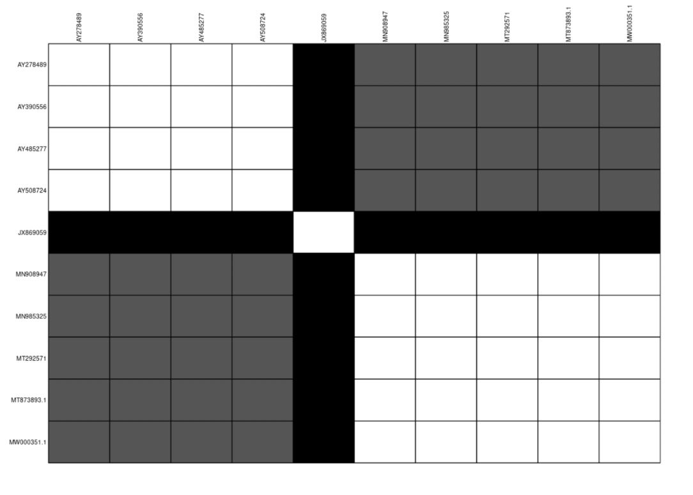
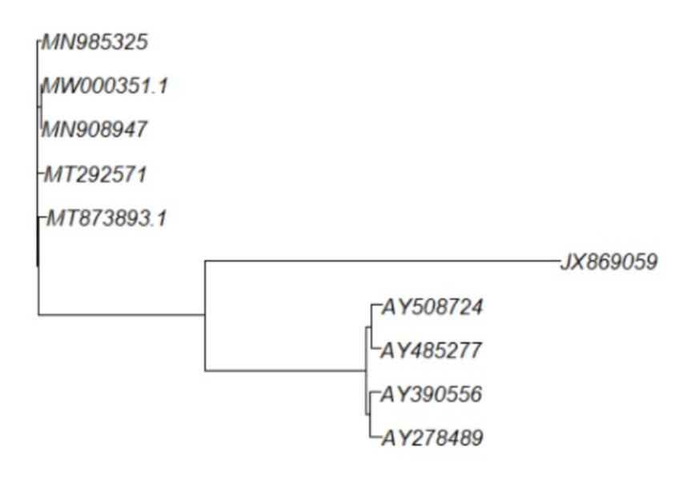

# Análisis de las variantes del Covid-19

## Longitud variantes

    
    

        Figura 1. Longitud variantes del covid
    

## Porcentaje de GC

    
    

        Figura 2. Porcentaje de Guanina y Citocina de las variantes del covid
    

## Porcentaje de AGCT de cada variante

    
    

        Figura 3. Porcentaje de AGCT de cada variante
    

## Alineamiento de los genomas

    
    

        Figura 4. Alineamiento de los genomas virales (primeros 150 nucleótidos)
    

    
    

        Figura 5. Alineamiento de los genomas virales (500 a 650)
    

## Tabla de grises

    
    

        Figura 6. Tabla de grises de la matriz de distancia
    

## Árbol filogenético

    
    

        Figura 7. Árbol filogenético
    

